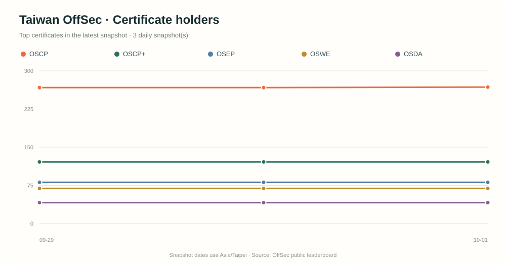

# 台灣 OffSec 證照觀測

每日統計 OffSec 全球排行榜中，台灣（`TW`）與全球帳號的公開證照資料，並以 GitHub Pages 呈現持有人數及歷史趨勢。全球頁面另提供可拖曳旋轉的互動地球，顯示各國帳號分布。部署時會預先產生完整 HTML，讓搜尋引擎不必執行 JavaScript 就能讀到主要統計內容。

## 每日證照趨勢

下圖由每日更新流程重新產生，呈現最新快照中持有人數最多的五種證照：



目前歷史資料從 **2026-09-29** 開始累積；快照增加後，圖表會逐日連成趨勢線。

## GitHub Repository Description

> 每日追蹤 OffSec 全球排行榜中台灣帳號的公開證照數量，保存歷史快照並以 GitHub Pages 呈現趨勢。

## 功能

- 每天抓取台灣累計排行榜資料，統計各證照列出的帳號數。
- 每天分頁擷取完整全球排行榜，彙總各國帳號與證照人數；全球資料獨立保存在 `data/global-snapshots.json`。
- 以互動地球依國家顯示全球持有人數，支援拖曳旋轉、縮放及點選國家查看證照統計。
- 以國名下拉選單快速選擇國家或地區，並同步查看地圖與證照統計。
- 將未設定國家的帳號獨立列出，並提示國別證照數會受個人檔案設定影響。
- 全球頁面以英文呈現，並支援繁體中文、日文切換。
- 全球頁面載入時用 ipapi.co 判斷瀏覽者國家並預選；ipapi.co 會收到瀏覽者公開 IP，手動選擇不會被覆蓋。
- 顯示 OffSec 台灣帳號總數、至少擁有一張證照的帳號數、證照種類及持有人數趨勢。
- 列出所有公開證照的 Badge 圖片與持有人數。
- 以階梯排行榜突顯持有證照張數最多的前三個台灣帳號。
- 使用台北時區記錄每日快照；同一天重跑會更新當日資料，不會新增重複日期。
- 保留 Git 歷史，不需要資料庫或 API 金鑰。

## 資料保存方式

`data/snapshots.json` 保存台灣歷史，`data/global-snapshots.json` 保存全球及各國的彙總歷史。全球快照不保存完整帳號明細。每日 GitHub Actions 工作流程更新兩個 JSON，並依台灣歷史重繪 `assets/certificate-trends.svg`，再一併提交；GitHub Pages 隨後重新部署兩個頁面。

第一次執行會建立第一筆快照。本專案已在 **2026-09-29（台北時間）** 建立起始快照；之後每次成功執行會累積一個新的日期，形成趨勢資料。

## 建立 GitHub Pages

1. 在 GitHub 建立新的 repository，將本專案推送到 `main` 分支。
2. 開啟 repository 的 **Settings → Pages**，將 **Build and deployment** 的來源設為 **GitHub Actions**。
3. 確認 repository 的 Actions 有權限提交內容：進入 **Settings → Actions → General → Workflow permissions**，選擇 **Read and write permissions**。
4. 推送到 `main` 後，`Deploy to GitHub Pages` 工作流程會發布網站。每日資料更新成功後也會觸發重新部署。

網站網址通常是 `https://<GitHub 帳號>.github.io/<repository 名稱>/`。在 **Settings → Pages** 可查看實際網址。

## 每日更新

`.github/workflows/daily-update.yml` 設定於每天 **08:00 與 20:00（Asia/Taipei）** 執行，也可以從 repository 的 **Actions** 頁面手動執行。更新流程會：

1. 從 OffSec Portal 取得台灣累計排行榜，並逐頁擷取完整全球排行榜。
2. 依排行榜帳號彙總證照持有人數、國家分布及持有證照張數最多的台灣帳號。
3. 更新台灣與全球各自歷史檔中的今天快照並提交變更。
4. 成功完成後觸發 GitHub Pages 重新部署，產生含最新統計的兩個 HTML 頁面、`sitemap.xml` 和 `robots.txt`。

全球快照以實際取得並去重的帳號作為統計值，並另外保留 API 回報的排行榜總數，方便檢視分頁期間排行榜變動造成的差異。

## 本機更新

```sh
python3 scripts/update_data.py
python3 scripts/update_global_data.py
```

## 統計範圍與限制

- 台灣資料來自 OffSec Portal 公開全球排行榜 API，篩選 `countryCode=TW`；全球資料使用相同 API，但不套用國家篩選。兩者皆使用 `timeFilter=ALL_TIME`。
- 統計的是排行榜帳號 `credentials` 欄位中列出的證照，不等同 OffSec 官方完整持證人數。
- 一個帳號可以列出多張證照，因此各證照人數加總會高於持有至少一張證照的帳號數。
- 排行榜成員、國家設定或 API 欄位改變，都可能造成每日數字變動。
- 全球排行榜在分頁抓取期間可能持續更新，因此快照也記錄 API 回報總數，供核對實際取得的去重帳號數。
- 此 API 未公開文件，若 API 格式改變，更新工作流程可能需要調整。

## 專案檔案

```text
.
├── .github/workflows/
│   ├── daily-update.yml   # 每日抓取與提交快照
│   └── pages.yml          # GitHub Pages 部署
├── data/snapshots.json    # 每日歷史資料
├── data/global-snapshots.json # 全球與各國彙總歷史資料
├── assets/certificate-trends.svg # README 每日趨勢圖
├── scripts/update_data.py # API 擷取與統計
├── scripts/update_global_data.py # 全球分頁擷取與各國彙總
├── scripts/render_site.py # 產生預先渲染的 HTML 與 sitemap
├── scripts/render_global_site.py # 產生全球頁面與國家排行
├── app.js                 # 儀表板呈現與趨勢圖
├── global.js              # 互動地球與全球統計
├── global.html            # 全球證照頁面
├── index.html             # 網站頁面
├── global.css              # 全球頁面樣式
└── style.css              # 共用網站樣式
```
